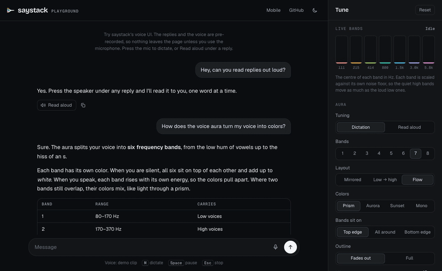
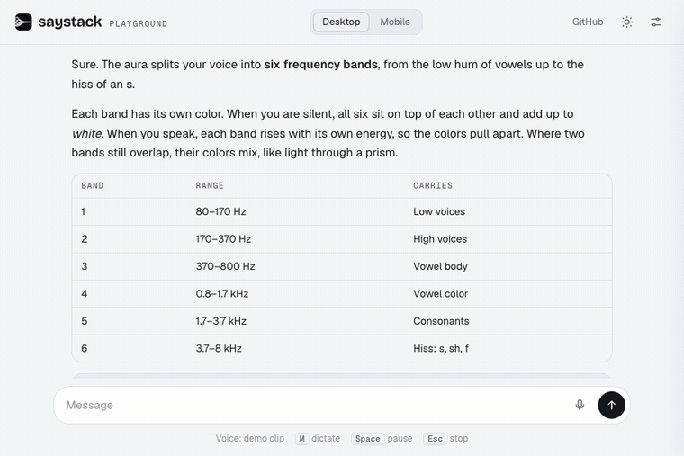
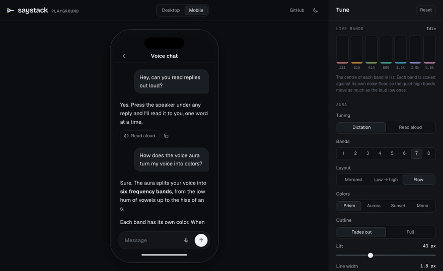

<p align="center">
  <picture>
    <source media="(prefers-color-scheme: dark)" srcset=".github/assets/logo-dark.svg" />
    
  </picture>
</p>

<p align="center">
  <a href="https://github.com/devladinci/saystack/actions/workflows/ci.yml"></a>
  <a href="https://www.npmjs.com/package/@saystack/core"></a>
</p>

<p align="center">
  <b><a href="https://devladinci.github.io/saystack/">Try it in the playground</a></b>: dictate, hear a reply read aloud, and tune the aura with live band meters. Nothing to install.
</p>

<p align="center">
  
</p>

Voice I/O for LLM chat UIs. Turn model output into speakable text, chunk it so playback can start
before the answer finishes, highlight the words as they are read, and capture speech back — against
any OpenAI-compatible TTS/STT engine.

It is a set of small, separately installable pieces rather than a framework. `@saystack/core` has no
runtime dependencies and no vendor knowledge; engines and UI plug into its contracts.

saystack is pre-1.0: APIs may still change in minor versions, and every change is in the changelog.

## What it does

- **Speakable text.** Strip markdown, code, tables and rules out of a reply, split it into blocks and
  chunk it for streaming playback — so audio starts before the reply is complete.
- **Read-along.** Map the words being spoken onto the words on screen and highlight them, including
  word-level timings when the engine provides them.
- **Dictation.** Stream recognised words into a composer as they are said, with a realtime WebSocket
  path and a plain upload path.
- **A voice UI.** A spectral aura that reacts to the voice, a read-aloud player, a per-message speaker
  button, mobile dictation/read-aloud spotlights.
- **Engines behind a seam.** `ISttAdapter`, `ITtsAdapter` and `ISttRealtimeAdapter` are the only things
  an engine must implement.

<p align="center">
  
</p>

Every part of the look is a setting. In the playground's tune panel you can change the colors, the layout, the
number of bands and where they sit while the voice plays, then copy the code for what you picked.

<p align="center">
  
</p>

## Packages

| Package                                                                   | What it is                                                                                                 |
| ------------------------------------------------------------------------- | ---------------------------------------------------------------------------------------------------------- |
| [`@saystack/core`](packages/core)                                         | Engine-agnostic core: text, chunking, sessions, timings, aura and audio maths. No runtime dependencies.    |
| [`@saystack/web`](packages/web)                                           | Browser audio: WebAudio unlock, recording, PCM capture, read-along over live DOM ranges, the WebGL aura.   |
| [`@saystack/react`](packages/react)                                       | Shared React state for speech and dictation. Not bound to any platform.                                    |
| [`@saystack/react-web`](packages/react-web)                               | React components and hooks for the web: read-aloud, the player, dictation, the aura.                       |
| [`@saystack/react-native`](packages/react-native)                         | The same ideas for React Native: spotlights, captions, native recording and playback.                      |
| [`@saystack/server`](packages/server)                                     | Optional Hono routes and a realtime WebSocket bridge that keep engine tokens on the server.                |
| [`@saystack/engine-openai-compatible`](packages/engine-openai-compatible) | An engine for any OpenAI-compatible `/v1` server: STT, TTS, OpenAI Realtime live dictation, normalization. |

## Engines

`@saystack/engine-openai-compatible` speaks the standard OpenAI endpoints, so it is not tied to one server:

| Feature              | Endpoint                               | Adapter                                              |
| -------------------- | -------------------------------------- | ---------------------------------------------------- |
| Dictation (upload)   | `POST /v1/audio/transcriptions`        | `createOpenAiSttAdapter`                             |
| Read aloud           | `POST /v1/audio/speech`                | `createOpenAiTtsAdapter`                             |
| Live dictation       | `WS /v1/realtime?intent=transcription` | `createOpenAiRealtimeSttAdapter`                     |
| Live dictation, oMLX | `WS /v1/audio/transcriptions/realtime` | `createOmlxRealtimeSttAdapter` (oMLX's own protocol) |
| Speech rewriting     | `POST /v1/chat/completions`            | `createLlmNormalizer`                                |

Each piece takes its own URL and model, so they can point at different servers — for example a local
server for speech and a hosted model for rewriting. Any other engine plugs in by implementing
`ISttAdapter`, `ITtsAdapter` or `ISttRealtimeAdapter` from `@saystack/core`.

Tested end to end against: oMLX (all of the above). The OpenAI Realtime adapter is tested against a
fake server that follows OpenAI's published protocol; it has not yet been run against a live one.

## React Native

`@saystack/react-native` needs `expo-audio`, `expo-file-system` and `expo-modules-core`. `expo-gl` (the aura) and `expo-blur` (the
spotlight backdrop) are optional: without them the aura is off and a stronger veil stands in for the blur.

With pnpm, `expo-gl` can find an incomplete `react-native-reanimated` that another package pulled in, and
fail at startup. expo-gl only probes reanimated inside a `try`, so an app that does not use reanimated can
make that lookup fail on purpose in `metro.config.js`:

```js
const EXPO_GL = `${path.sep}expo-gl${path.sep}`;
const resolveRequest = config.resolver.resolveRequest;
config.resolver.resolveRequest = (context, moduleName, platform) => {
  if (moduleName === "react-native-reanimated" && context.originModulePath.includes(EXPO_GL)) {
    throw new Error("react-native-reanimated is not part of this app");
  }
  return (resolveRequest ?? context.resolveRequest)(context, moduleName, platform);
};
```

## Layout

```
core                     text, chunking, sessions, aura maths        no deps, no DOM
 ├── web                 the browser implementation
 ├── engine-openai-…     an engine implementation
 └── react               shared React state
      ├── react-web      web components
      └── react-native   native components
server                   optional HTTP + websocket layer
examples/voice-chat      a complete chat wired end to end
apps/playground          the hosted playground (not published)
```

Dependencies only ever point downward, and `core` never learns about a vendor or a platform.

## Getting started

```bash
pnpm install
pnpm -r build
```

The playground, on the packages in this repo:

```bash
pnpm --filter @saystack/playground dev
```

Every check at once:

```bash
pnpm check     # lint, format, typecheck, build, test, knip
```

The full example runs on OpenAI with one key, or on any OpenAI-compatible server — see
[`examples/voice-chat`](examples/voice-chat):

```bash
ENGINE_TOKEN=sk-… pnpm --filter @saystack/example-voice-chat dev
```

### Minimal read-aloud

```tsx
import { ReadAloudProvider, ReadAloudPlayer, useReadAloudMessage } from "@saystack/react-web";
import "@saystack/react-web/styles.css";

function Reply({ id, markdown }: { id: string; markdown: string }) {
  const ref = useRef<HTMLDivElement | null>(null);
  const { phase, speak, stop } = useReadAloudMessage(id, ref);
  const isSpeaking = phase === "playing" || phase === "paused";

  const handleClick = (): void => {
    if (isSpeaking) {
      stop();
      return;
    }

    speak(markdown);
  };

  return (
    <div ref={ref}>
      <button onClick={handleClick}>{isSpeaking ? "Stop" : "Read"}</button>
      <Markdown source={markdown} />
    </div>
  );
}

export function App({ children }: { children: ReactNode }) {
  return (
    <ReadAloudProvider endpoint="/api/tts" headers={() => ({ authorization: token })} summarize={summarize}>
      {children}
      <ReadAloudPlayer />
    </ReadAloudProvider>
  );
}
```

`endpoint` and `headers` describe _your_ backend. `summarize` lets the server decide what a long reply
should sound like before it is spoken: it receives `(id, markdown, signal)` and returns the shorter text
to speak instead, or `null` to speak the reply as written.

## Developing

- Package code is TypeScript, ESM only, built with `tsc`. No bundler.
- `pnpm format` and `pnpm lint` before pushing; CI runs format, lint, typecheck, build, test and knip.
- `pnpm knip` finds unused files, exports and dependencies. Public library surface is configured in
  [`knip.json`](knip.json).
- Releases use [Changesets](.changeset): `pnpm changeset`, then merge the version pull request.

## Contributing

See [CONTRIBUTING.md](CONTRIBUTING.md). Report security problems privately, as [SECURITY.md](SECURITY.md) explains.

## License

MIT
